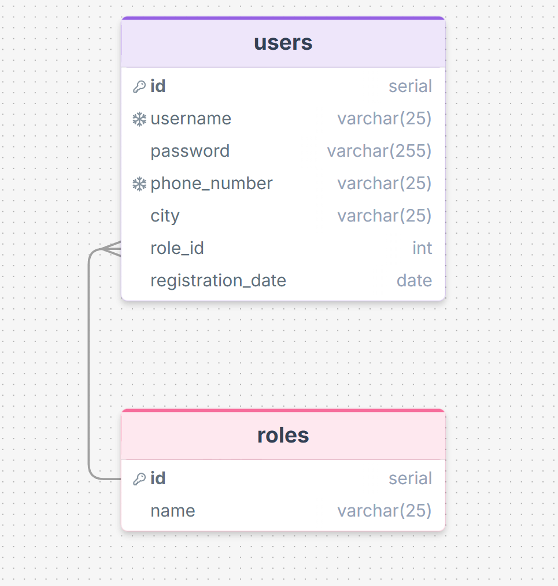
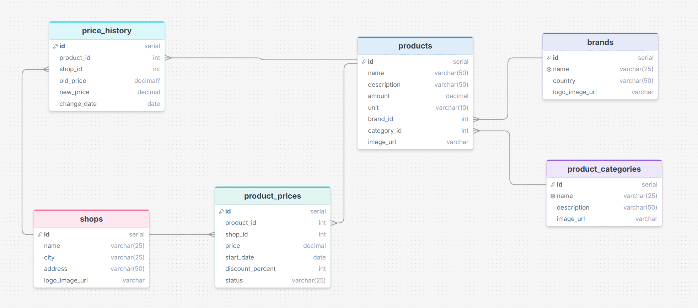
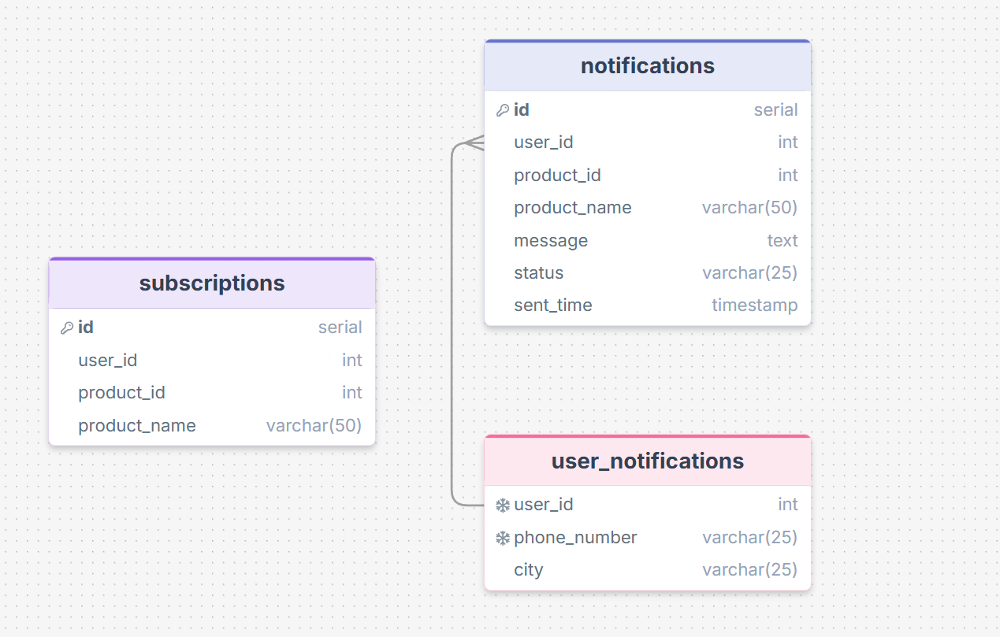
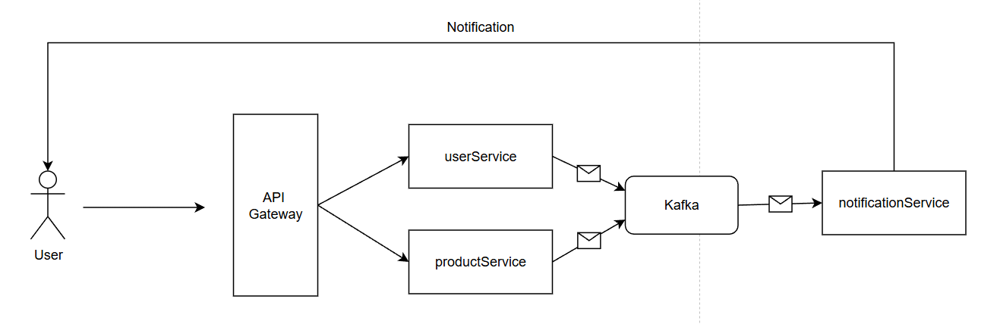

## **Сервис народного мониторинга цен на продукты питания**

### 1. Функциональные требования

- Регистрация пользователей (администраторы, пользователи).
- Редактирование профиля.
- Справочник категорий товаров, справочник торговых точек.
- Просмотр списка товаров по категориям. Поиск и фильтрация.
- Возможность добавления / редактирования / удаления товара.
- Возможность привязать цену к товару в конкретном магазине на текущий момент.
- Возможность отслеживать динамику цен на тот или иной продукт в заданном периоде (в табличном виде).
- Сравнение цен по позициям в различных магазинах (хотя бы двух).
- Возможность графического отображения динамики изменения цен.
- Возможность пакетного добавления информации о ценах и продуктах (например, загрузка в формате CSV, JSON и др.).
- Возможность пользователю подписаться на какой-либо товар и получать уведомления на телефон при скидке.
- Изменение цен обычными пользователями с модерацией и подтверждением.
- Поиск товаров по запросу пользователя через модуль AI.

### 2. Архитектура

3 микросервиса:

- Микросервис пользователей (регистрация, аутентификация, редактирование профиля).




- Микросервис товаров и цен (добавление товара, поиск товаров, фильтрация, привязка цены к товару в магазине, справочник магазинов и т.д)




- Микросервис нотификаций (уведомление пользователей о скидках на подписанный товар).







Пользователь отправляет запрос на сервер, с помощью API Gateway он перенаправляется на нужный микросервис. При регистрации/обновлении данных пользователей сообщения с изменениями отправляются в кафку, откуда их считывает notificationService и обновляет локальные данные для отправки уведомлений. ProductService отправляет сообщения в кафку при обновлении цены на товар, notificationService считывает сообщение, делает выборку пользователей, которые подписаны на данный товар, формирует сообщения и отправляет их через сторонний сервис.