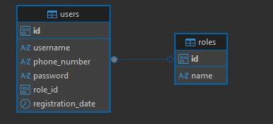
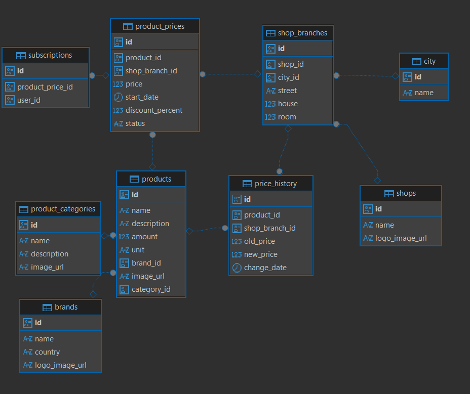
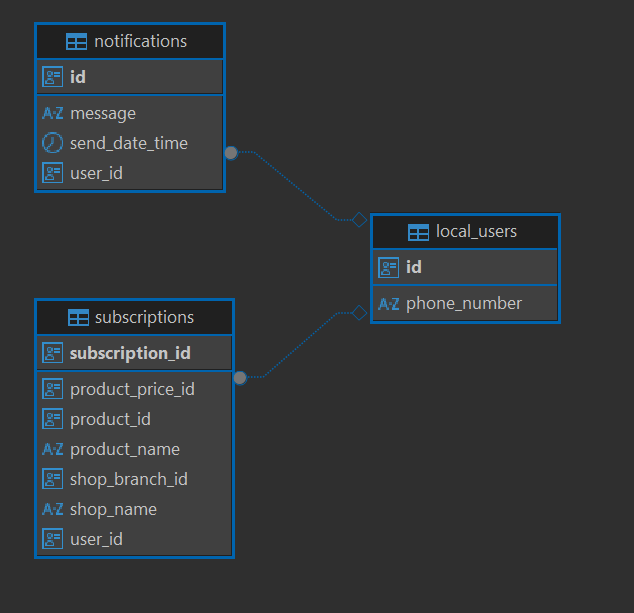
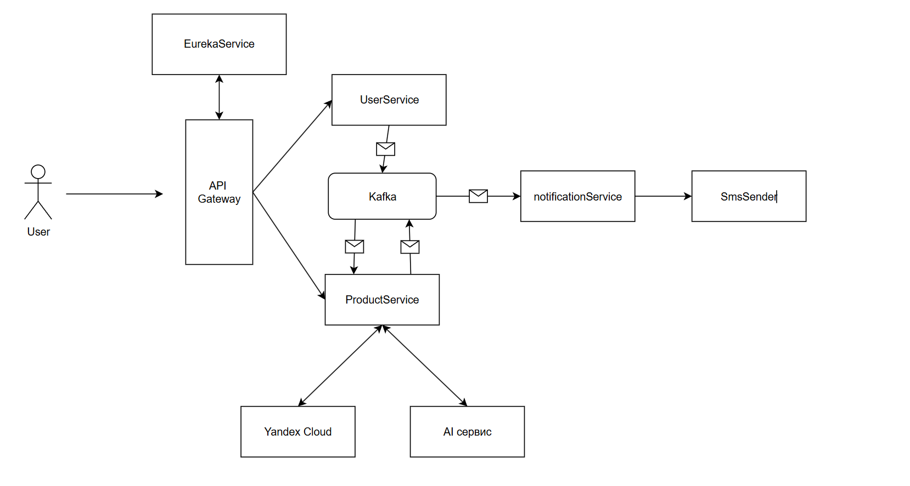

## **Сервис народного мониторинга цен на продукты питания**

### 1. Функциональные требования

- Регистрация пользователей (администраторы, пользователи).
- Редактирование профиля.
- Возможность пользователя посмотреть свои подписки на товары и цены на них в разных магазинах.
- Справочник категорий товаров, справочник торговых точек.
- Просмотр списка товаров по категориям. Поиск и фильтрация.
- Возможность добавления / редактирования / удаления товара.
- Возможность привязать цену к товару в конкретном магазине на текущий момент.
- Возможность отслеживать динамику цен на тот или иной продукт в заданном периоде (в табличном виде).
- Сравнение цен по позициям в различных магазинах (хотя бы двух).
- Возможность графического отображения динамики изменения цен.
- Возможность пакетного добавления информации о ценах и продуктах (например, загрузка в формате CSV, JSON и др.).
- Возможность пользователю подписаться на какой-либо товар и получать уведомления на телефон при скидке.
- Изменение цен обычными пользователями с модерацией и подтверждением.
- Поиск товаров по запросу пользователя через модуль Spring AI.

---

### 2. Роли и права

Роли: Администратор и Пользователь

Функционал пользователя:

1. Регистрация и авторизация.
2. Редактирование данных профиля.
3. Просмотр каталога товаров, торговых точек, магазинов, просмотр цен.
4. Создание заявки на изменение цены на товар в торговой точке.
5. Поиск товаров по запросу.
6. Добавление товара в избранное.
7. Возможность просмотреть историю цен.
8. Сравнение цен в разных магазинах на продукт.

Функционал администратора:

1. Просмотр всех зарегистрированных пользователей в системе и возможность удаленить аккаунт пользователя.
2. Добавление/редактирование/удаление товаров, магазинов, торговых точек, городов, привязка цены к товару в магазине.
3. Возможность пакетного добавления товаров и цен.
4. Подтверждение или удаление заявок пользователей на изменение цены на товар.

---

### 3. Структура

Проект создан с использованием микросервисной архитектуры и включает в себя несколько сервисов.

1. Eureka service
2. API Gateway (ApiGateway) как единая точка входа и маршрутизация запросов пользователя
3. User service (UserService):
    - Регистрация и авторизация
    - Редактирование профиля
    - Удаление пользователя для администратора
4. Notification service (NotificationService):
    - Рассылка уведомлений пользователя о скидке на избранный товар
5. Product service (ProductService):
    - Добавление/редактирование/просмотр/удаление данных о товарах, ценах, магазинах, торговых точек
    - Поиск товаров
    - Добавление товара в избранное
    - Смотреть историю изменения цен на товар

---

### 4. Структура баз данных для микросервисов

- Микросервис пользователей (UserService)

- Микросервис товаров и цен (добавление товара, поиск товаров, фильтрация, привязка цены к товару в магазине, справочник
  магазинов и т.д)

- Микросервис нотификаций (уведомление пользователей о скидках на подписанный товар).

- Взаимодействие микросервисов

Порядок запуска

1. EurekaService
2. NotificationService, ProductService, UserService в любом порядке
3. ApiGateway
---

### 5. Kafka

Настройки:  
Для подключения локально использовать адрес localhost:9092, для подключения внутри докер контейнеров - kafka:29092.   
Хранение сообщений настроено через параметр KAFKA_LOG_RETENTION_MS, значение выставлено для 10 минут.   
Репликация топиков отключена. Создан volume - kafka-data для сохранения данных при перезапуске контейнера.
Гарантия доставки - exactly once

Топики:
1. update-product-price - топик для событий изменения цены на товар, слушается notification-service для уведомления.
2. new-user - топик для событий регистрации пользователя, слушается notifcation-service для сохранения данных для отправки уведомления локально.
3. update-user - топик для событий изменения данных пользователя, слушатеся notification-service для обновления данных по локальному пользователю.
4. delete-user - топик для событий удаления администратором пользователя, слушается notification-service и product-service для удаления подписок и локальных данных.

---

### 6. Внешние сервисы
1. Для хранения фотографий используется облачное хранилище YandexCloudService, куда в отдельные папки сохраняются фотографии/логотипы брендом, категорий товаров, товаров и магазинов.
2. Для отправки уведомления на телефон пользователю используется SmsSender, к которому делается http запрос. Запрос содержит название проекта в системе SmsSender, номер телефона получателя, текст сообщения и api ключ.
3. Для поиска товаров по запросу пользователя используется модуль Spring AI, который отправляет запрос в нейронку. Нейронка преобразует запрос в dto для поиска данных в бд, если ничего не удалось преобразовать оставляет все поля пустыми.

---

### 7. Дополнительно

- Создавать администратора нужно через ручное изменение роли в базе данных
- Ключ для проверки валидности JWT токена хранится на каждом из микросервисов в application.properties в поле jwt.secret.access. Выдает ключ user-service, который отдает access и refresh токен пользователю, время жизни access токена 10 минут. При истечении этого срока делается запрос /refresh с переданным refresh токеном и пользователю выдается новый access токен.

---

### 8. Технологии
1) Java 17
2) Spring Boot (Spring Security, Spring Validation, Spring Data JPA)
3) Hibernate
4) Kafka
5) PostgreSQL 17
6) JUnit 5 и Mockito для модульных тестов
7) Liquibase
8) Mapstruct
9) Spring Cloid (API Gateway, Eureka Service)
10) Docker
